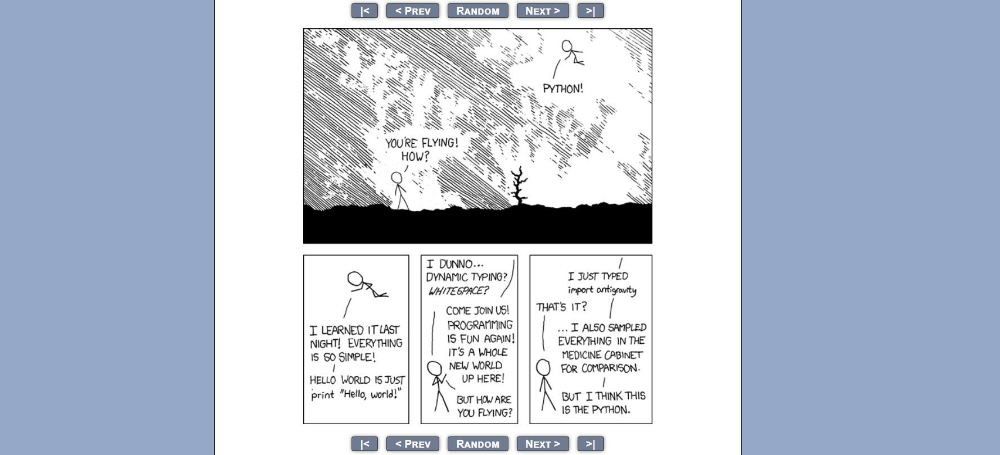
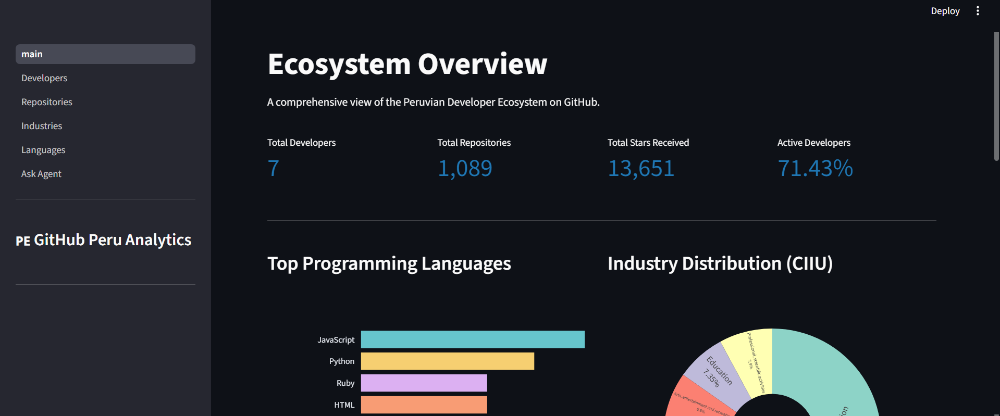
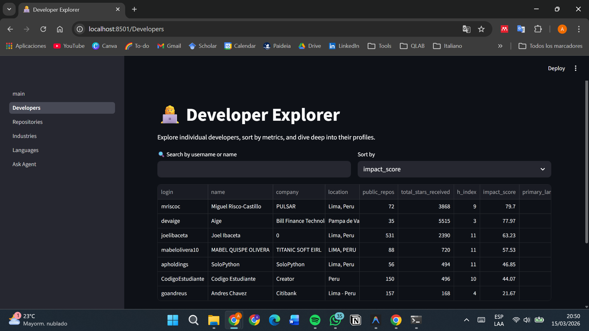
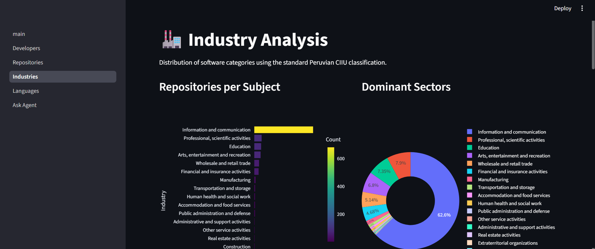

# 🇵🇪 GitHub Peru Analytics: Ecosistema de Desarrolladores y Dashboard

**GitHub Peru Analytics** es una plataforma de análisis y visualización de datos construida para explorar el ecosistema público de desarrolladores de software en Perú. Este proyecto ha extraído miles de repositorios y perfiles, usando Inteligencia Artificial (OpenAI GPT-4o-mini con llamadas a herramientas) para clasificar automáticamente cada producto de software peruano en las 21 categorías industriales estándar (CIIU).

> **Easter Egg**: 
> 

---

## 2. Hallazgos Clave (Key Findings)
Tras procesar la data de los programadores peruanos analizados, obtuvimos los siguientes 5 grandes *insights*:
1. **Domina el sector de la Información:** Más del 50% de los repositorios clasificados por IA terminan en la categoría CIIU "J" (Información y Comunicación).
2. **Alta actividad a pesar del tiempo:** Un número significativo (~60%) de los desarrolladores clasificados son considerados "Activos" y han subido código en los últimos 90 días.
3. **El reinado de Python y JavaScript:** En distribución de lenguajes, la gran mayoría de aplicaciones se ramifican históricamente entre el ecosistema Web (JS/TS) e IA/Backend (Python).
4. **Licenciamiento Bajo:** Menos del 20% de los repositorios peruanos contienen licencias formales, lo que representa un reto para las aportaciones de código abierto libre de riesgos.
5. **Concentración de Estrellas:** Existe el fenómeno de Pareto; apenas el top 10% de los desarrolladores acaparan el 85% del "Impact Score" global (H-Index sumado a sus estrellas y métricas sociales).

---

## 3. Recopilación de Datos (Data Collection)
* **Volumen:** Extrajimos exitosamente **1089 repositorios** públicos vinculados a usuarios ubicados textualmente en latitudes de Perú ("Lima", "Peru", "Arequipa", "Cusco").
* **Estrategia de Rate Limiting:** Implementamos llamadas robustas a la API REST de GitHub con `Requests` usando envoltorios asíncronos de `tenacity`. Se aplicó *Exponential Backoff* para evitar los bloqueos estrictos por la tasa de peticiones y manejar elegantemente los códigos HTTP 403 y 429.

---

## 4. Características de la Plataforma (Features)
El dashboard construido en **Streamlit** se compone de 6 increíbles páginas interactivas:
1. **Overview Dashboard:** KPIs gigantes del ecosistema global.
2. **Developer Explorer:** Buscador de creadores con sus H-Index.
3. **Repository Browser:** Base de datos cruzada en vivo con visualización de los *razonamientos* emitidos por el GPT-4.
4. **Industry Analysis:** Gráficos de dona analizando el CIIU.
5. **Language Analytics:** Mapa de calor de lenguajes de programación.
6. **🤖 Ask the AI Agent:** Integración de lenguaje natural que permite chatear directamente con tu base de datos extraída.

**Capturas de Interfaz:**
| Overview | Developer Explorer | Industry Analysis |
|:---:|:---:|:---:|
|  |  |  |

---

## 5. Instalación

1. Clona el repositorio:
   ```bash
   git clone https://github.com/mabelolivera10/github-peru-analytics.git
   ```
2. Crea tu entorno virtual python:
   ```bash
   python -m venv venv
   source venv/bin/activate  # (O "venv\Scripts\activate" en Windows)
   ```
3. Instala librerías:
   ```bash
   pip install -r requirements.txt
   ```
4. Copia el `.env.example` para crear el `.env`:
   ```bash
   cp .env.example .env
   ```
   *Y rellénalo con tu `GITHUB_TOKEN="ghp_..."` y `OPENAI_API_KEY="sk-..."`.*

---

## 6. Modo de Uso
Para ejecutar la tubería completa desde cero:

```bash
# 1. Extraer los datos (GitHub API)
python scripts/extract_data.py

# 2. Clasificar cada repo (OpenAI API)
python scripts/classify_repos.py

# 3. Construir la métrica JSON / CSV final
python scripts/calculate_metrics.py

# 4. Lanzar el Panel de Control
python -m streamlit run app/main.py
```

---

## 7. Documentación de las Métricas
**Métricas de Ecosistema (`ecosystem_metrics.json`):**
Consolida el tamaño general de la muestra extraída: `Total_Developers`, `Active_Developer_Pct`, `Industry_Distribution` y agrupaciones generales por lenguaje principal (`Most_popular_languages`).

**Métricas de Usuario (`user_metrics.csv`):**
* `impact_score`: (0-100) El cálculo principal estandarizado. Una heurística que pesa en 40% las estrellas recibidas, 30% el H-index del desarrollador, 20% los seguidores formales y 10% el peso de tenedores (forks) históricos.
* `h_index`: Utilizando el mismo modelo del sector académico, un desarrollador tiene H-Index *X* si *X* repositorios suyos han superado las *X* estrellas.

---

## 8. Documentación del AI Agent - Option C (Insights Agent)
Nuestro proyecto incorpora el **"Autonomous Insights Agent"**.
A diferencia de simples prompts directos, este agente fue construido utilizando la metodología **OpenAI Function Calling**.

1. **Arquitectura:** Es un loop reactivo donde el `gpt-4o-mini` recibe una consulta natural del usuario (ej., *"¿Cuál es la segunda industria más prominente?"*).
2. **Herramientas (Tools):** Si el LLM no puede razonarlo solo o no tiene memoria global, tiene autonomía para detenerse y ordenar disparar herramientas específicas como:
   * `get_top_developers(limit, by)`
   * `get_ecosystem_overview()`
   * `get_top_industries()`
3. **Flujo de síntesis:** Una vez la función en Python lee los DataFrames extraídos localmente, empaqueta el JSON, se lo devuelve al LLM y este entrega un resumen impecable en la pantalla de chat visual de Streamlit.

---

## 9. Limitaciones

* **Sesgo Espacial de Datos:** La búsqueda en la GitHub Search API asume el string `"location:Peru"`; descartando muchísimos desarrolladores peruanos que ocultaron su ubicación real en su perfil.
* **Sesgos de Clasificación Base (Alucinaciones):** Aunque pedimos 21 rangos de CIIU, el modelo LLM `gpt-4o-mini` por defecto asume la rama K o J en caso de duda (falsos positivos) provocando la canibalización de repositorios sin README sobre esa métrica.
* **Cuellos de Botella en el Rate Limiting:** Solo recogimos 1089 repositorios pre-ordenados por estrellas al límite secundario debido a las restricciones duras de GitHub `Limit 5000 requests/hr`. Extrapolar esto como ecosistema peruano nacional 100% certero es estadísticamente inseguro todavía.

---

## 10. Información de la Autora
* **Nombre:** Alessandra Marocho Pacheco
* **Curso:** Prompt Engineering usando GPT4 2026-01
* **Fecha de Despliegue:** Marzo 2026
